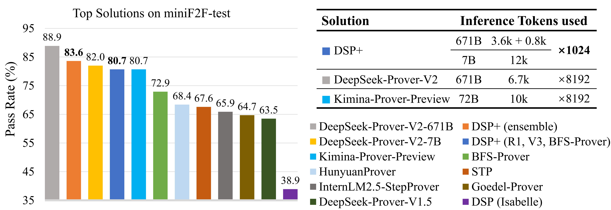
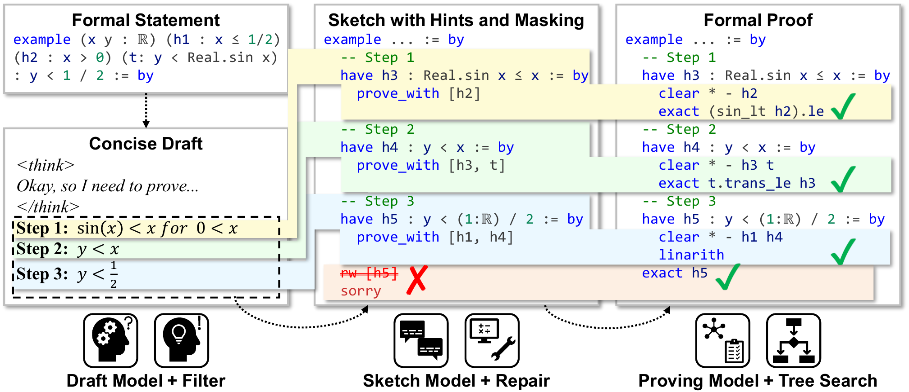

# Reviving DSP for Advanced Theorem Proving in the Era of Reasoning Models

<p align="center">
  <b> Microsoft Research </b></a>
</p>

<p align="center">
  <a href="https://arxiv.org/abs/2506.11487"><b>Paper Link</b>📃</a>
</p>

<p align="center">
  <a href="#introduction">Introduction</a> |
  <a href="#core-method">Core Method</a> |
  <a href="#evaluation-results">Evaluation Results</a> |
  <a href="#setup-environment">Setup Environment</a> |
  <a href="#quick-start">Quick Start</a> |
  <a href="#verify-solutions">Verify Solutions</a> |
  <a href="#contributing">Contributing</a> |
  <a href="#citation">Citation</a> |
  <a href="#contact">Contact</a> |
  <a href="#acknowledgements">Acknowledgements</a>
</p>

## Introduction

Recent advancements, such as **DeepSeek-Prover-V2-671B** and **Kimina-Prover-Preview-72B**, demonstrate a prevailing trend in leveraging reinforcement learning (RL)-based large-scale training for automated theorem proving. Surprisingly, we discover that even without any training, careful neuro-symbolic coordination of existing off-the-shelf reasoning models and tactic step provers can achieve comparable performance. 

We introduces **DSP+**, an improved version of the Draft, Sketch, and Prove framework, featuring a *fine-grained and integrated* neuro-symbolic enhancement for each phase:

1. **In the Draft phase**, we prompt reasoning models to generate concise natural-language subgoals, removing thinking tokens and references to human-written proofs;
2. **In the Sketch phase**, subgoals are autoformalized, and sketch lines containing syntactic errors are masked according to predefined rules;
3. **In the Proving phase**, we integrate symbolic search methods like Aesop with step provers to establish proofs for the sketch subgoals.

Experimental results show that, without any additional model training or fine-tuning, DSP+ solves 80.7%, 32.8%, and 24 out of 644 problems from miniF2F, ProofNet, and PutnamBench, respectively, while requiring fewer budgets compared to state-of-the-arts. DSP+ proves **imo_2019_p1**, an IMO problem in miniF2F that is not solved by any prior work.

Additionally, DSP+ generates proof patterns comprehensible by human experts, facilitating the identification of formalization errors; For example, eight wrongly formalized statements in miniF2F are discovered. Our results highlight the potential of classical reasoning patterns besides the RL-based training.


<p align="center">
  
</p>


## Core Method

### Draft Phase: Thinking and Conciseness

In DSP+, the draft model (e.g., QwQ-32B, DeepSeek-R1) receives the formal statement directly. These reasoning models utilize `<think>` tokens to enable deep reasoning and self-reflection, leading to more accurate results. The output is prompted to be **concise**, containing only the key formulas of each proof step, which helps avoid overloading the sketch model. The format of outputs is carefully designed to balance consistency and flexibility.

---

### Sketch Phase: LLM Hints and Error Line Masking

The sketch model autoformalizes the concise proof from the draft phase into structured subgoals in formal language, without proving them. Each subgoal explicitly lists its supporting hypotheses using a format like `prove_with [h2]`, serving as hints for the proving model. To handle syntax errors, an **error line masking** strategy is applied: invalid subgoal lines and dependent content are either commented out or replaced with `sorry`, preserving as much correct content as possible without re-running the sketch phase.

---

### Proving Phase: Step Prover and Tree Search

To complete the proof, DSP+ integrates a **step prover** (e.g., BFS-Prover, InternLM2.5-StepProver) with symbolic **tree search** (e.g., Aesop). The step prover predicts the next tactic based on the current proof state, while tree search explores tactic sequences. This hybrid approach allows the system to eliminate placeholders like `prove_with` and `sorry`, producing full proofs more efficiently and accurately.

<p align="center">
  
</p>


## Evaluation Results

DSP+ achieves competitive performance on miniF2F-test, ProofNet, and PutnamBench, rivaling top RL-trained models like Kimina-Prover-Preview-72B, while using fewer inference tokens. Its ensemble (combination of different configurations) further improves accuracy, approaching DeepSeek-Prover-V2-671B under the same budget. And DSP+ even finds a proof for imo_2019_p1, an IMO problem not solved previously.

<table>
  <thead>
    <tr>
      <th rowspan="2">Type</th>
      <th>Solution (Model Size)</th>
      <th>Sample Budget</th>
      <th>miniF2F-test</th>
      <th>ProofNet</th>
      <th>PutnamBench</th>
      <th>miniF2F/IMO</th>
    </tr>
  </thead>
  <tbody>

  <!-- Whole-proof Generation -->
  <tr>
    <td rowspan="24">Whole-proof Generation</td>
    <td rowspan="3">Goedel-Prover-7B</td>
    <td>32</td><td>57.6%</td><td>15.2%</td><td>6/644</td><td>--</td>
  </tr>
  <tr><td>512</td><td>62.7%</td><td>--</td><td>7/644</td><td>--</td></tr>
  <tr><td>25600</td><td>64.7%</td><td>--</td><td>--</td><td>--</td></tr>

  <tr><td rowspan="2">STP-7B</td><td>3200</td><td>65.0%</td><td>23.9%</td><td>8/644</td><td>--</td></tr>
  <tr><td>25600</td><td>67.6%</td><td>26.9%</td><td>--</td><td>--</td></tr>

  <tr><td rowspan="4">Kimina-Prover-Preview-7B</td>
    <td>1</td><td>52.5%</td><td>--</td><td>--</td><td>--</td></tr>
  <tr><td>32</td><td>63.1%</td><td>--</td><td>--</td><td>--</td></tr>
  <tr><td>192</td><td>--</td><td>--</td><td><strong>10/644</strong></td><td>--</td></tr>
  <tr><td>1024</td><td>70.8%</td><td>--</td><td>--</td><td>--</td></tr>

  <tr><td rowspan="5">Kimina-Prover-Preview-72B</td>
    <td>1</td><td>52.9%</td><td>--</td><td>--</td><td>--</td></tr>
  <tr><td>8</td><td>65.2%</td><td>--</td><td>--</td><td>--</td></tr>
  <tr><td>32</td><td>68.9%</td><td>--</td><td>--</td><td>--</td></tr>
  <tr><td>1024</td><td>77.9%</td><td>--</td><td>--</td><td>--</td></tr>
  <tr><td>8192</td><td><strong>80.7%</strong></td><td>--</td><td>--</td><td><strong>40%</strong></td></tr>

  <tr><td rowspan="5">DeepSeek-Prover-V2-7B</td>
    <td>1</td><td>58.6%</td><td>--</td><td>--</td><td>--</td></tr>
  <tr><td>32</td><td>75.6%</td><td>23.0%</td><td>11/658</td><td>--</td></tr>
  <tr><td>128</td><td>--</td><td>25.4%</td><td>15/658</td><td>--</td></tr>
  <tr><td>1024</td><td>79.9%</td><td><strong>29.6%</strong></td><td><strong>23/658</strong></td><td>--</td></tr>
  <tr><td>8192</td><td><strong>82.0%</strong></td><td>--</td><td>--</td><td>--</td></tr>

  <tr><td rowspan="5">DeepSeek-Prover-V2-671B</td>
    <td>1</td><td>61.9%</td><td>--</td><td>--</td><td>--</td></tr>
  <tr><td>32</td><td>82.4%</td><td>30.5%</td><td>22/658</td><td>--</td></tr>
  <tr><td>128</td><td>--</td><td>33.6%</td><td>33/658</td><td>--</td></tr>
  <tr><td>1024</td><td>86.6%</td><td><strong>37.1%</strong></td><td><strong>49/658</strong></td><td>--</td></tr>
  <tr><td>8192</td><td><strong>88.9%</strong></td><td>--</td><td>--</td><td><strong>50%</strong></td></tr>

  <!-- Tree Search -->
  <tr><td rowspan="7">Tree Search</td>
    <td rowspan="2">InternLM2.5-StepProver-7B</td>
    <td>2×32×600</td><td>50.7%</td><td>--</td><td>6/640</td><td>--</td></tr>
  <tr><td>256×32×600</td><td>65.9%</td><td><strong>27.0%</strong></td><td>--</td><td>--</td></tr>

  <tr><td rowspan="2">DeepSeek-Prover-V1.5-RL-7B + RMaxTS</td>
    <td>4×6400</td><td>59.6%</td><td>25.3%</td><td>--</td><td>--</td></tr>
  <tr><td>32×6400</td><td>63.5%</td><td>--</td><td>--</td><td>--</td></tr>

  <tr><td>HunyuanProver-7B</td>
    <td>600×8×400</td><td>68.4%</td><td>--</td><td>--</td><td>20%</td></tr>

  <tr><td rowspan="2">BFS-Prover-7B</td>
    <td>2048×2×600</td><td>70.8%</td><td>--</td><td>--</td><td><strong>25%</strong></td></tr>
  <tr><td>accumulative</td><td>73.0%</td><td>--</td><td>--</td><td>--</td></tr>

  <!-- Hybrid -->
  <tr><td rowspan="10">Hybrid</td>
    <td>DSP (GPT-4o, Isabelle)</td><td>10</td><td>--</td><td>--</td><td>4/640</td><td>--</td></tr>
  <tr><td>DSP (Minerva-540B, Isabelle)</td><td>100</td><td>38.9%</td><td>--</td><td>--</td><td>5%</td></tr>

  <tr><td rowspan="5">DSP+ (QwQ-32B, V3-671B, BFS-Prover-7B)</td>
    <td>1</td><td>52.5%</td><td>--</td><td>--</td><td>--</td></tr>
  <tr><td>8</td><td>68.4%</td><td>--</td><td>--</td><td>--</td></tr>
  <tr><td>32</td><td>71.3%</td><td>24.7%</td><td>15/644</td><td>--</td></tr>
  <tr><td>128</td><td>74.2%</td><td><strong>32.8%</strong></td><td><strong>24/644</strong></td><td>--</td></tr>
  <tr><td>1024</td><td>79.5%</td><td>--</td><td>--</td><td><strong>40%</strong></td></tr>

  <tr><td>DSP+ (QwQ-32B, QwQ-32B, BFS-Prover-7B)</td><td>1024</td><td>79.1%</td><td>--</td><td>--</td><td>--</td></tr>
  <tr><td>DSP+ (R1-671B, V3-671B, BFS-Prover-7B)</td><td>1024</td><td><strong>80.7%</strong></td><td>--</td><td>--</td><td>--</td></tr>
  <tr><td>DSP+ (ensemble)</td><td>accumulative</td><td><strong>83.6%</strong></td><td><strong>33.9%</strong></td><td><strong>25/644</strong></td><td><strong>45%</strong></td></tr>

  </tbody>
</table>


## Setup Environment

### Requirements

* Supported platform: Linux
* Python 3.10
* **CMake >= 3.7**
* C++17 compatible compiler

### Installation

1. **Install Lean 4**

   Follow the instructions on the [Lean 4 installation page](https://leanprover.github.io/lean4/doc/quickstart.html) to set up Lean 4.

   If you are using Debian/Ubuntu, you can also install Lean 4 using the following command according to [How to install Lean 4 on Debian/Ubuntu](https://leanprover-community.github.io/install/debian.html):

   ```sh
   wget -q https://raw.githubusercontent.com/leanprover-community/mathlib4/master/scripts/install_debian.sh && bash install_debian.sh ; rm -f install_debian.sh && source ~/.profile
   ```

2. **Clone the repository**

   ```sh
   git clone --recurse-submodules https://github.com/microsoft/DSP-Plus.git
   cd DSP-Plus
   ```

3. **Install dependencies**

   ```sh
   pip install -r requirements.txt
   ```

4. **Build Mathlib4**

   ```sh
   cd mathlib4
   lake build RulesetInit && lake build LeanCopilot && lake build repl && lake build
   ```

## Quick Start

If you have enough GPU resources, you can deploy local models with OpenAI-Compatible APIs using tools like **[vLLM](https://github.com/vllm-project/vllm)**, **[SGLang](https://github.com/sgl-project/sglang)**, and so on. For example, to run models like `bytedance-research/BFS-Prover` locally using vLLM, please refer to the [vLLM OpenAI-Compatible Server documentation](https://docs.vllm.ai/en/latest/getting_started/quickstart.html#openai-compatible-server). You can also use the remote APIs, such as the one provided by [Microsoft Azure AI Foundry](https://ai.azure.com/).

Configure all draft, sketch, proving models and other parameters in `configs/default.py`. The file provides an explanation for each parameter. 

To run paper experiments, you can use the following script to launch a DSP+ workflow:

```sh
python dsp_workflow.py --config config/default.py
```

> _⚠️ Notice: If you only want to run a single data point for quick verification, using [quick_start.py](https://github.com/microsoft/DSP-Plus/blob/main/quick_start.py) is a good choice. It will run a problem in series until successful or until the maximum number of attempts is reached. You can also manually interrupt it._

## Verify Solutions

Extract the `minif2f-test-solution.zip` archive into the `mathlib4/Proof` directory. Each proof file should be located at a path like `mathlib4/Proof/imo_2019_p1.lean`. Here is the reference command:

```sh
unzip minif2f-test-solution.zip -d mathlib4
```

Then, run `lake build Proof` inside the `mathlib4` directory to verify the correctness of all solutions:

```sh
cd mathlib4
lake build Proof
```

## Contributing

* For general questions and discussions, please use [GitHub Discussions](https://github.com/microsoft/DSP-Plus/discussions).  
* To report a potential bug, please open an issue in [GitHub Issues](https://github.com/microsoft/DSP-Plus/issues).

## Citation
```latex
@misc{cao2025revivingdspadvancedtheorem,
      title={Reviving DSP for Advanced Theorem Proving in the Era of Reasoning Models}, 
      author={Chenrui Cao and Liangcheng Song and Zenan Li and Xinyi Le and Xian Zhang and Hui Xue and Fan Yang},
      year={2025},
      eprint={2506.11487},
      archivePrefix={arXiv},
      primaryClass={cs.AI},
      url={https://arxiv.org/abs/2506.11487}, 
}
```

## Contact
For any inquiries, please contact us at [zhxian@microsoft.com](mailto:zhxian@microsoft.com), [caochenrui@mail.ustc.edu.cn](mailto:caochenrui@mail.ustc.edu.cn), or [slc1@mail.ustc.edu.cn](mailto:slc1@mail.ustc.edu.cn).

## Acknowledgements

We gratefully acknowledge the authors of the datasets, implementation baselines, and formal verification tools (such as Lean) that supported our research.